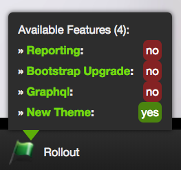

Zend Framework 2 Module - Rollout
=======

[](https://travis-ci.org/adlogix/zf2-opensoft-rollout) [](https://scrutinizer-ci.com/g/adlogix/zf2-opensoft-rollout/?branch=master) [](https://packagist.org/packages/adlogix/zf2-opensoft-rollout) [](https://packagist.org/packages/adlogix/zf2-opensoft-rollout) [](https://packagist.org/packages/adlogix/zf2-opensoft-rollout) [](https://packagist.org/packages/adlogix/zf2-opensoft-rollout)

A ZF2 Module for [opensoft/rollout](https://github.com/opensoft/rollout)

# Installation

1. Install the module via composer by running:

```bash
composer require adlogix/zf2-opensoft-rollout:~1.0
```

2. Add the `Adlogix\Zf2Rollout` module to the module section of your `config/application.config.php`

# Configuration

Rollout parameters can be defined in the application configurations:

```php
<?php
return [
    'rollout' => [

        // Service id to obtain a Opensoft\Rollout\RolloutUserInterface instance
        'user_service' => null,

        // Service id to obtain a Opensoft\Rollout\Storage\StorageInterface instance
        'storage_service' => 'zf2_rollout_storage_array',

        // Required configuration if storage service is Adlogix\Zf2Rollout\Storage\ZendDbAdapterStorage
        'zend_db_storage' => [
            'table_name' => 'rollout_feature'
        ],

        // Required configuration if storage service is Adlogix\Zf2Rollout\Storage\Doctrine\DoctrineORMStorage
        'doctrine_storage' => [
            'class_name' => SomeFeatureEntity::class
        ]
    ],
]
```

# Usage

To retrieve the rollout service from a zend controller:

```php
<?php

$rollout = $this->getServiceLocator()->get('zf2_rollout');
```

Refer to the documentation of [opensoft/rollout](https://github.com/opensoft/rollout) for more information on how to use the library.

## Zend Developer Toolbar

The module comes with support for the zend developer toolbar.



:warning: The ZDT rollout comes with a quick toggling action, allowing the user to quickly enable/disable a feature by clicking on one of the listed feature elements in the toolbar. Make sure to only authorise these actions in development mode. :warning:

An example of enabling the end points with BjyAuthorize:

```php
<?php

// config/autoload/authorization.development.php

use Adlogix\Zf2Rollout\Service\Controller\RolloutController;

return [
    'bjyauthorize' => [

        'guards' => [

            // Add this if you are adding guards on controllers
            'BjyAuthorize\Guard\Controller' => [
                ['controller' => RolloutController::class, 'roles' => ['guest','user']],
            ],

            // Add this if you are adding guards on routes
            'BjyAuthorize\Guard\Route' => [
                ['route' => 'rollout_feature_toggle', 'roles' => ['guest','user']],
            ],
        ],

    ],
];

```
